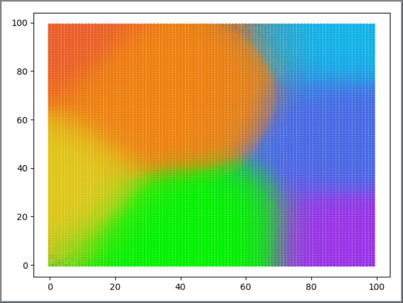
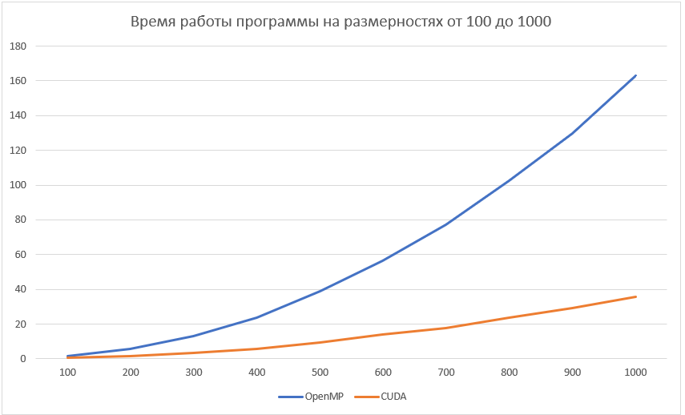

# Самоорганизующаяся карта Кохонена 

Нейронная сеть с обучением без учителя, выполняющая задачу визуализации и кластеризации.

Является методом проецирования многомерного пространства в пространство с более низкой размерностью (чаще всего, двумерное), применяется также для решения задач моделирования, прогнозирования, выявление наборов независимых признаков, поиска закономерностей в больших массивах данных, разработке компьютерных игр, квантизации цветов к их ограниченному числу индексов в цветовой палитре: при печати на принтере и ранее на ПК или же на приставках с дисплеем с пониженным числом цветов, для архиваторов или видео-кодеков, и прч. Является одной из версий нейронных сетей Кохонена.

Самоорганизующаяся карта Кохонена была реализована с помощью двух технологий параллельного программирования: OpenMP и CUDA. Для визуализации использовался Python и Matplotlib.

## Результат работы программ

Карта 100х100 после обучения выглядит вот так:

Обучение проводилось с помощью 7 обучающих векторов красного, оранжевого, желтого, зеленого, голубого, синего и фиолетового.

Статистика времени работы программ:

